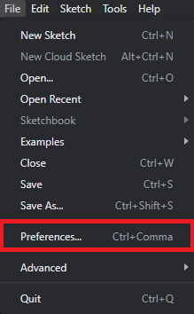
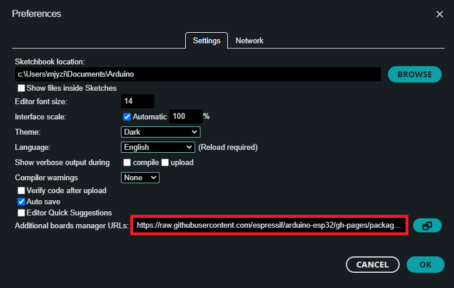

<h1 align="center"> Issa Scope v0.2</h1>
<h3 align="center">  An ethoscope for optogenetics behavioural essays</h3>

<h6 align="right">developed by M.J.Y. Zimmermann</h6>

  

This project is licensed under the <a href="https://www.gnu.org/licenses/gpl-3.0.html">GNU General Public License v3.0</a>

The hardware is licensed under the <a href="https://cern-ohl.web.cern.ch">CERN OHL v1.2</a>

  

***

  

- [Introduction](#Introduction)
- [EthoScope](#Ethoscope)
- [PCB](#PCB)
- [ESP32/Arduino microcontroller](#Microcontroller)
  - [Driver Installation](#Driver%20Installation)
- [GUI](#GUI)

- [To-Do-List](#To-Do-List)

  

***

  

## Introduction

  

## Ethoscope

The Ethoscope consists of 15mm extruded aluminium bars purchased from <a href="https://www.makerbeam.com/makerbeamxl/">MakerBeam</a> (XL profile), and 3D printed parts.

  

## PCB

Dedicated PCBs for all electronics components contained in the scope base and platform stimulating LEDs can be found <a href="https://github.com/OpenSourceNeuro/IssaScope/tree/main/PCB"><strong>here</strong></a> along with detailed instructions to reproduce and adapt them.

  
<h3 align="left">Ethoscope Main Board</h3>

The PCB is built around an <a href="https://www.espressif.com/en/products/socs/esp32">ESP32</a>, a microcontroller which exchanges signals with the recording setup, and the <a href="https://www.ti.com/lit/ds/symlink/tlc5947.pdf">TLC5947 LED driver</a>, which allows linear intensity control over all stimulating lights. The microcontroller runs on C++ however, users do not need to interfere with the source code as we provide an intuitive and interactive <a href="">Graphical User Interface</a> (GUI), from which all functions and variables can be manipulated.

<h5 align="center"> <em>Left: </em>PCB schematics for the IssaScope v0.2, <em>Middle: PCB layout for manufacturing</em>, <em>Right: </em>Rendering of the board populated with electronics components</h5>

 

The board provides connections via Molex JST plugs for 4 * four LED channels meant to be used for 4 * four distinct optogenetics light sources.

It also provides ports for base illumination for both white and infra red lights, designed for providing light below the samples.

Remaining ports provide access to unuse GPIO pins on the microcontroller for further upgrade (I/O signals, sensors, motors, etc.)

The board takes a 24V input, a tension above this value will result in damaging the board components.

  

This repository contains detailed <a href="https://github.com/OpenSourceNeuro/OpenSpritzer-V2/blob/main/Installation_Manual.md">assembly instructions and an operation manual</a> for the Scope electronics assembly. The <a href="https://github.com/OpenSourceNeuro/OpenSpritzer-V2/blob/main/BOM.csv">bill of material</a> details all components required.

To simplify the wiring assembly, a customed circuit board has been designed. PCB prototype companies (i.e. <a href="jlcpcb.com"> JLCPCB</a>) will only require the <a href="https://github.com/OpenSourceNeuro/IssaScope/tree/main/PCB/IssaScope_gerbers  "> gerber.zip</a> folder to be sent to them for production.

  

## Microcontroller

#### Driver Installation

 

IssaScope v0.2 firmware runs on an Espressif ESP32 board and requires the USB to UART bridge <a href="https://www.silabs.com/developers/usb-to-uart-bridge-vcp-drivers"> CP210x driver</a>,  which can be downloaded<a href="https://www.silabs.com/developers/usb-to-uart-bridge-vcp-drivers?tab=downloads"> <strong>here</strong></a>.

Once the driver has been installed, users can upload and modify the <a href="https://https://github.com/OpenSourceNeuro/IssaScope/tree/main/Arduino/IssaScope.com/OpenSourceNeuro/OpenSpritzer-V2/tree/main/Arduino/OpenSpritzer_V2">microcontroller code</a> through the <a href="https://www.arduino.cc/en/software">Arduino IDE</a> (Integrated Development Environment).

  

<h4 align="left">Microcontroller Arduino code</h4>

 

##### Arduino IDE

 

The ESP32 microcontroller runs a C++ code which can be accessed via the Arduino IDE, which can be downloaded <a href="https://www.arduino.cc/en/software"><strong>here</strong></a>.

 

##### ESP32 Add-on

 

Once the IDE is installed, users needs to install the ESP32 board library:

In the Arduino IDE, go to <strong> File > Preferences </strong>

Enter the following link into the <strong>Additional Board Manager URLs</strong> field:

https://raw.githubusercontent.com/espressif/arduino-esp32/gh-pages/package_esp32_index.json

Then click on the <strong>OK</strong> button.

  

Next, open the Boards Manager. Go to <strong> Tools > Board > Board Manager...</strong>

Search for ESP32 and press install button for the <strong>ESP32 by Espressif Systems</strong>.

Then click on the <strong>Install</strong> button.

  

##### Compiling the code

 

Within the Arduino IDE, user needs to select the FQBN (Fully Qualified Board Name) on which the code will be compiled for.

Here the ESP32 Dev Module needs to be selected.

Go to <strong>Tools > Board > esp32 > ESP32 Dev Module </strong>

The board name should be displayed  as shown.

  

  

## GUI

  

## To-Do-List

- Find suitable material for close up hanging LEDs
