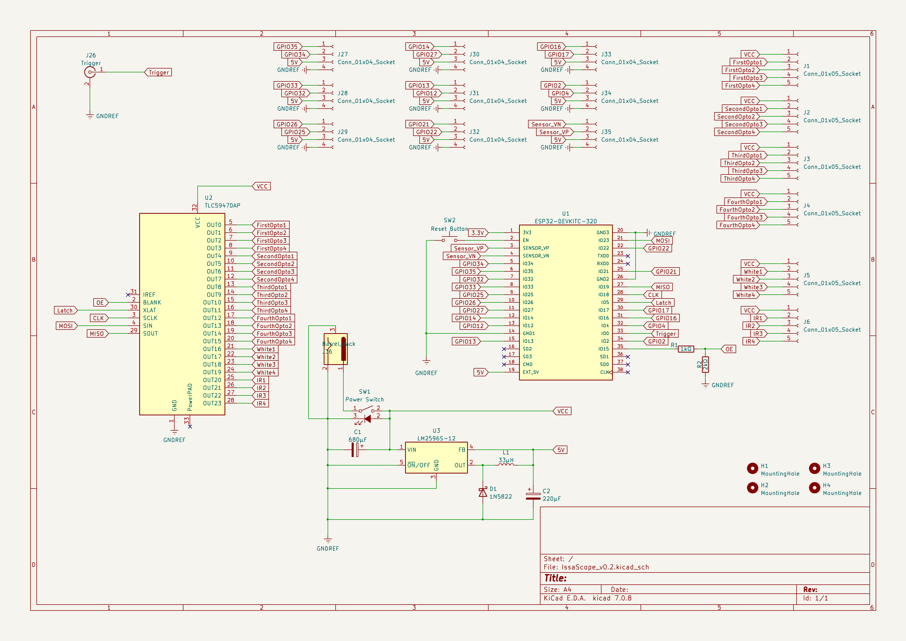
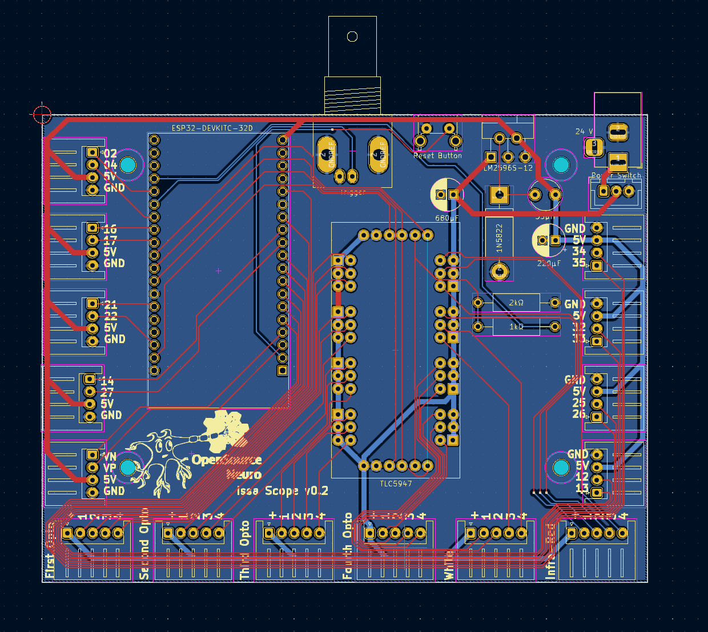
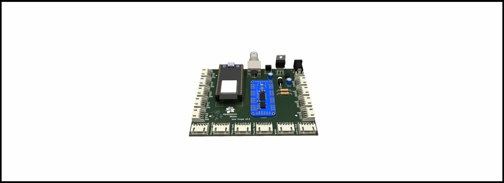

<h1 align="center"> Issa Scope v0.2</h1>
<h3 align="center">  An ethoscope for optogenetics behavioural essays</h3>

<h6 align="right">developed by M.J.Y. Zimmermann</h6>

  

This project is licensed under the <a href="https://www.gnu.org/licenses/gpl-3.0.html">GNU General Public License v3.0</a>

The hardware is licensed under the <a href="https://cern-ohl.web.cern.ch">CERN OHL v1.2</a>

  

***

  

- [Introduction](#Introduction)
- [EthoScope](#Ethoscope)
  - [PCB](#PCB)
  - [ESP32/Arduino microcontroller](#Microcontroller)
  - [GUI](#GUI)
- [LarvaeScope](#LarvaeScope)
- [To-Do-List](#To-Do-List)

  

***

  

## Introduction

  

## Ethoscope

The Ethoscope consists of 15mm extruded aluminium bars purchased from <a href="https://www.makerbeam.com/makerbeamxl/">MakerBeam</a> (XL profile), and 3D printed parts.

  

## PCB

Dedicated PCBs for all electronics components contained in the scope base and platform stimulating LEDs can be found <a href="https://github.com/OpenSourceNeuro/IssaScope/tree/main/PCB">here</a> along with detailed instructions to reproduce and adapt them.

  
<h3 align="left">Ethoscope Main Board</h3>

The PCB is built around an <a href="https://www.espressif.com/en/products/socs/esp32">ESP32</a>, a microcontroller which exchanges signals with the recording setup, and the <a href="https://www.ti.com/lit/ds/symlink/tlc5947.pdf">TLC5947 LED driver</a>, which allows linear intensity control over all stimulating lights. The microcontroller runs on C++ however, users do not need to interfere with the source code as we provide an intuitive and interactive <a href="">Graphical User Interface</a> (GUI), from which all functions and variables can be manipulated.

<h5 align="center"> <em>Left: </em>PCB schematics for the IssaScope v0.2, <em>Middle: PCB layout for manufacturing</em>, <em>Right: </em>Rendering of the board populated with electronics components</h5>

 

The board provides connections via Molex JST plugs for 4 * four LED channels meant to be used for 4 * four distinct optogenetics light sources.

It also provides ports for base illumination for both white and infra red lights, designed for providing light below the samples.

Remaining ports provide access to unuse GPIO pins on the microcontroller for further upgrade (I/O signals, sensors, motors, etc.)

The board takes a 24V input, a tension above this value will result in damaging the board components.

  

This repository contains detailed <a href="https://github.com/OpenSourceNeuro/OpenSpritzer-V2/blob/main/Installation_Manual.md">assembly instructions and an operation manual</a> for the Scope electronics assembly. The <a href="https://github.com/OpenSourceNeuro/OpenSpritzer-V2/blob/main/BOM.csv">bill of material</a> details all components required.

To simplify the wiring assembly, a customed circuit board has been designed. PCB prototype companies (i.e. <a href="jlcpcb.com"> JLCPCB</a>) will only require the <a href="https://github.com/OpenSourceNeuro/OpenSpritzer-V2/tree/main/PCB_Rack%20version"> gerber.zip</a> folder to be sent to them for production.

## Microcontroller

  

## GUI

  

## To-Do-List

- Find suitable material for close up hanging LEDs
